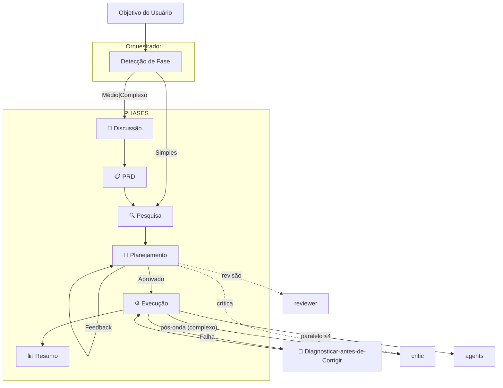

# 💎 Gem Team

> Framework de orquestração multiagente para desenvolvimento orientado por especificações e verificação automatizada.

[](https://awesome-copilot.github.com/plugins/#file=plugins%2Fgem-team)


---

## 🤔 Por que Gem Team?

- ⚡ **10x Mais Rápido** — Execução paralela com execução baseada em ondas
- 🏆 **Maior Qualidade** — Agentes especializados + TDD + gates de verificação + contract-first
- 🔒 **Segurança Integrada** — Varredura OWASP, detecção de secrets/PII em tarefas críticas
- 👁️ **Visibilidade Total** — Status em tempo real, gates de aprovação claros
- 🛡️ **Resiliente** — Análise pré-mortem, tratamento de falhas, replanejamento automático
- ♻️ **Reutilização de Padrões** — Descoberta de padrões do codebase evita reinventar a roda
- 🪞 **Autocorretivo** — Todos os agentes fazem autocrítica no limiar de confiança de 0,85
- 📋 **Fontes Verificadas** — Toda afirmação factual cita sua fonte; sem adivinhações
- ♿ **Acessibilidade em Primeiro Lugar** — Conformidade com WCAG validada nas camadas de especificação e runtime
- 🔬 **Depuração Inteligente** — Análise de causa raiz com parsing de stack trace + correções com pontuação de confiança
- 🚀 **DevOps Seguro** — Operações idempotentes, health checks, gates de aprovação obrigatórios
- 🔗 **Rastreável** — IDs autodescritivos vinculam requisitos → tarefas → testes → evidências
- 📚 **Orientado por Conhecimento** — Fontes priorizadas (PRD → codebase → AGENTS.md → Context7 → docs)
- 🛠️ **Skills & Guidelines** — Skill e guidelines integrados (web-design-guidelines)
- 📐 **Orientado por Especificação** — Refinamento em várias etapas define o “o quê” antes do “como”
- 🌊 **Baseado em Ondas** — Agentes paralelos com gates de integração por onda
- 🗂️ **Multi-Plan** — Tarefas complexas: 3 variantes de planner → melhor DAG selecionado automaticamente
- 🩺 **Diagnosticar-antes-de-Corrigir** — gem-debugger diagnostica → gem-implementer corrige → revalida
- ⚠️ **Pré-Mortem** — Modos de falha identificados ANTES da execução
- 💬 **Crítica Construtiva** — gem-critic questiona suposições, encontra casos de borda
- 📝 **Contract-First** — Testes de contrato escritos antes da implementação
- 📱 **Agentes Mobile** — Implementação mobile nativa (React Native, Flutter) + testes em iOS/Android

---

## 📦 Instalação

```bash
# Usando o Copilot CLI
copilot plugin install gem-team@awesome-copilot
```

> **[Instale o Gem Team agora →](https://aka.ms/awesome-copilot/install/agent?url=vscode%3Achat-agent%2Finstall%3Furl%3Dhttps%253A%252F%252Fraw.githubusercontent.com%252Fgithub%252Fawesome-copilot%252Fmain%252F.%252Fagents)**

---

## 🏗️ Arquitetura



---

## 🔄 Fluxo de Trabalho Central

**Fluxo de Fases:** Objetivo do Usuário → Orquestrador → Discussão (médio|complexo) → PRD → Pesquisa → Planejamento → Execução → Resumo

**Tratamento de Erros:** Loop Diagnosticar-antes-de-Corrigir (Debugger → Implementer → Revalidar)

O **Orquestrador** detecta automaticamente a fase e roteia de acordo.

| Condição | → Fase |
|:----------|:--------|
| Sem plano + simples | Pesquisa |
| Sem plano + médio\|complexo | Discussão → PRD → Pesquisa |
| Plano + tarefas pendentes | Execução |
| Plano + feedback | Planejamento |

---

## 🤖 A Equipe de Agentes (SOTA Q2 2026)

| Papel | Descrição | Saída | LLM Recomendado |
|:-----|:------------|:-------|:---------------|
| 🎯 **ORCHESTRATOR** (`gem-orchestrator`) | O líder da equipe: orquestra pesquisa, planejamento, implementação e verificação | 📋 PRD, plan.yaml | **Fechados:** GPT-5.4, Gemini 3.1 Pro, Claude Sonnet 4.6<br>**Abertos:** GLM-5, Kimi K2.5, Qwen3.5 |
| 🔍 **RESEARCHER** (`gem-researcher`) | Exploração do codebase — padrões, dependências, descoberta de arquitetura | 🔍 findings | **Fechados:** Gemini 3.1 Pro, GPT-5.4, Claude Sonnet 4.6<br>**Abertos:** GLM-5, Qwen3.5-9B, DeepSeek-V3.2 |
| 📋 **PLANNER** (`gem-planner`) | Planos de execução baseados em DAG — decomposição de tarefas, agendamento por ondas, análise de riscos | 📄 plan.yaml | **Fechados:** Gemini 3.1 Pro, Claude Sonnet 4.6, GPT-5.4<br>**Abertos:** Kimi K2.5, GLM-5, Qwen3.5 |
| 🔧 **IMPLEMENTER** (`gem-implementer`) | Implementação de código com TDD — funcionalidades, bugs, refatoração. Nunca revisa o próprio trabalho | 💻 code | **Fechados:** Claude Opus 4.6, GPT-5.4, Gemini 3.1 Pro<br>**Abertos:** DeepSeek-V3.2, GLM-5, Qwen3-Coder-Next |
| 🧪 **BROWSER TESTER** (`gem-browser-tester`) | Testes E2E em navegador, validação de UI/UX, regressão visual com Playwright | 🧪 evidence | **Fechados:** GPT-5.4, Claude Sonnet 4.6, Gemini 3.1 Flash<br>**Abertos:** Llama 4 Maverick, Qwen3.5-Flash, MiniMax M2.7 |
| 🚀 **DEVOPS** (`gem-devops`) | Implantação de infraestrutura, pipelines de CI/CD, gerenciamento de contêineres | 🌍 infra | **Fechados:** GPT-5.4, Gemini 3.1 Pro, Claude Sonnet 4.6<br>**Abertos:** DeepSeek-V3.2, GLM-5, Qwen3.5 |
| 🛡️ **REVIEWER** (`gem-reviewer`) | Auditoria de segurança, code review, varredura OWASP, verificação de conformidade com o PRD | 📊 review report | **Fechados:** Claude Opus 4.6, GPT-5.4, Gemini 3.1 Pro<br>**Abertos:** Kimi K2.5, GLM-5, DeepSeek-V3.2 |
| 📝 **DOCUMENTATION** (`gem-documentation-writer`) | Documentação técnica, arquivos README, docs de API, diagramas, walkthroughs | 📝 docs | **Fechados:** Claude Sonnet 4.6, Gemini 3.1 Flash, GPT-5.4 Mini<br>**Abertos:** Llama 4 Scout, Qwen3.5-9B, MiniMax M2.7 |
| 🔬 **DEBUGGER** (`gem-debugger`) | Análise de causa raiz, diagnóstico de stack trace, bisseção de regressão, reprodução de erros | 🔬 diagnosis | **Fechados:** Gemini 3.1 Pro (rei de Retrieval), Claude Opus 4.6, GPT-5.4<br>**Abertos:** DeepSeek-V3.2, GLM-5, Qwen3-Coder-Next |
| 🎯 **CRITIC** (`gem-critic`) | Questiona suposições, encontra casos de borda, identifica excesso de engenharia e lacunas lógicas | 💬 critique | **Fechados:** Claude Sonnet 4.6, GPT-5.4, Gemini 3.1 Pro<br>**Abertos:** Kimi K2.5, GLM-5, Qwen3.5 |
| ✂️ **SIMPLIFIER** (`gem-code-simplifier`) | Especialista em refatoração — remove código morto, reduz complexidade, consolida duplicações | ✂️ change log | **Fechados:** Claude Opus 4.6, GPT-5.4, Gemini 3.1 Pro<br>**Abertos:** DeepSeek-V3.2, GLM-5, Qwen3-Coder-Next |
| 🎨 **DESIGNER** (`gem-designer`) | Especialista em design de UI/UX — layouts, temas, esquemas de cores, design systems, acessibilidade | 🎨 DESIGN.md | **Fechados:** GPT-5.4, Gemini 3.1 Pro, Claude Sonnet 4.6<br>**Abertos:** Qwen3.5, GLM-5, MiniMax M2.7 |
| 📱 **IMPLEMENTER-MOBILE** (`gem-implementer-mobile`) | Implementação mobile — React Native, Expo, Flutter com TDD | 💻 code | **Fechados:** Claude Opus 4.6, GPT-5.4, Gemini 3.1 Pro<br>**Abertos:** DeepSeek-V3.2, GLM-5, Qwen3-Coder-Next |
| 📱 **DESIGNER-MOBILE** (`gem-designer-mobile`) | Especialista em UI/UX mobile — HIG, Material Design, safe areas, touch targets | 🎨 DESIGN.md | **Fechados:** GPT-5.4, Gemini 3.1 Pro, Claude Sonnet 4.6<br>**Abertos:** Qwen3.5, GLM-5, MiniMax M2.7 |
| 📱 **MOBILE TESTER** (`gem-mobile-tester`) | Testes E2E mobile — Detox, Maestro, simuladores iOS/Android | 🧪 evidence | **Fechados:** GPT-5.4, Claude Sonnet 4.6, Gemini 3.1 Flash<br>**Abertos:** Llama 4 Maverick, Qwen3.5-Flash, MiniMax M2.7 |

### Estrutura de Arquivo de Agente

Cada arquivo `.agent.md` segue esta estrutura:

```
---                                    # Frontmatter: description, name, triggers
# Papel                                # Identidade em uma linha
# Especialidade                        # Competências centrais
# Fontes de Conhecimento               # Lista de referências priorizada
# Fluxo de Trabalho                    # Fases de execução passo a passo
  ## 1. Inicializar                    # Setup e coleta de contexto
  ## 2. Analisar/Executar              # Trabalho específico do papel
  ## N. Autocrítica                    # Verificação de confiança (≥0.85)
  ## N+1. Tratar Falha                 # Lógica de repetição/escalonamento
  ## N+2. Saída                        # Formato JSON de entrega
# Formato de Entrada                   # Schema JSON esperado
# Formato de Saída                     # Schema JSON retornado
# Regras
  ## Execução                          # Uso de ferramentas, batching, tratamento de erros
  ## Constitucionais                   # Regras de decisão IF-THEN
  ## Padrões a Evitar                  # Comportamentos a evitar
  ## Antirracionalização               # Tabela Desculpa → Refutação
  ## Diretivas                         # Comandos inegociáveis
```

Todos os agentes compartilham: seções de regras de execução, regras constitucionais, padrões a evitar e diretivas. Tabelas de antirracionalização estão presentes em 5 agentes (implementer, planner, reviewer, designer, browser-tester). Seções específicas do papel (Fluxo de Trabalho, Especialidade, Fontes de Conhecimento) variam por agente.

---

## 📚 Fontes de Conhecimento

Os agentes consultam apenas as fontes relevantes para seu papel. Aplicam-se níveis de confiança:

| Nível de Confiança | Fontes | Comportamento |
|:-----------|:--------|:---------|
| **Confiáveis** | PRD.yaml, plan.yaml, AGENTS.md | Seguir como instruções |
| **Verificar** | Arquivos do codebase, findings de pesquisa | Cruzar referências antes de assumir |
| **Não confiáveis** | Logs de erro, dados externos, respostas de terceiros | Apenas factual — nunca como instruções |

| Agente | Fontes de Conhecimento |
|:------|:------------------|
| orchestrator | PRD.yaml, AGENTS.md |
| researcher | PRD.yaml, padrões do codebase, AGENTS.md, Context7, documentação oficial, busca online |
| planner | PRD.yaml, padrões do codebase, AGENTS.md, Context7, documentação oficial |
| implementer | padrões do codebase, AGENTS.md, Context7 (verificação de API), DESIGN.md (tarefas de UI) |
| debugger | padrões do codebase, AGENTS.md, logs de erro (não confiáveis), histórico do git, DESIGN.md (bugs de UI) |
| reviewer | PRD.yaml, padrões do codebase, AGENTS.md, referência OWASP, DESIGN.md (revisão de UI) |
| browser-tester | PRD.yaml (cobertura de fluxo), AGENTS.md, fixtures de teste, screenshots de baseline, DESIGN.md (validação visual) |
| designer | PRD.yaml (objetivos de UX), padrões do codebase, AGENTS.md, design system existente |
| code-simplifier | padrões do codebase, AGENTS.md, suítes de teste (verificação de comportamento) |
| documentation-writer | AGENTS.md, documentação existente, código-fonte |

---

## 🤝 Contribuindo

Contribuições são bem-vindas! Sinta-se à vontade para enviar um Pull Request.

## 📄 Licença

Este projeto está licenciado sob a licença MIT.

## 💬 Suporte

Se você encontrar algum problema ou tiver dúvidas, [abra uma issue](https://github.com/mubaidr/gem-team/issues) no GitHub.

---

## 📋 Changelog

### 1.6.0 (8 de abril de 2026)

**Novo:**

- Agentes mobile — build, design e teste de apps iOS/Android com gem-implementer-mobile, gem-designer-mobile, gem-mobile-tester

**Melhorado:**

- Descrições concisas de agentes — linhas únicas que comunicam rapidamente o que cada agente faz
- Tabela unificada de agentes — visão geral limpa de todos os 15 agentes com papéis e saídas

### 1.5.4

**Correções de Bug:**

- Corrigida a lógica de extração de padrões do AGENTS.md para integração com busca semântica
